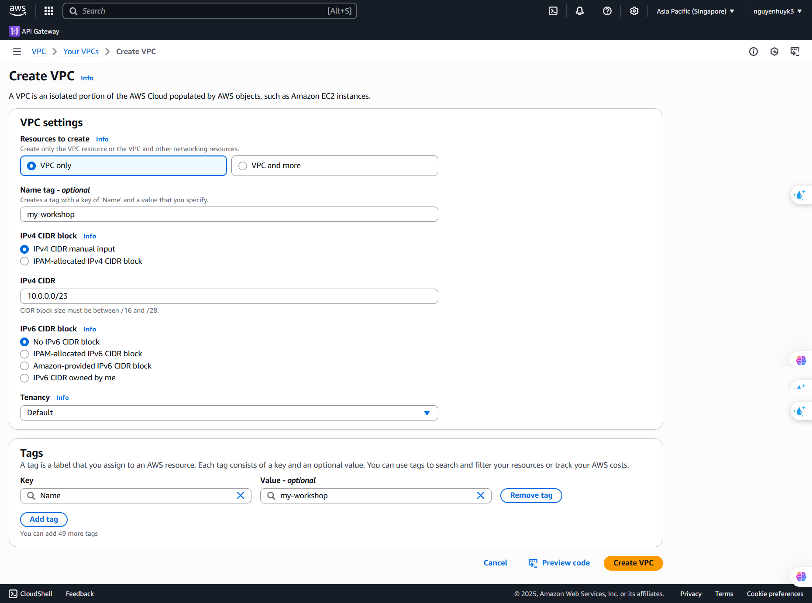
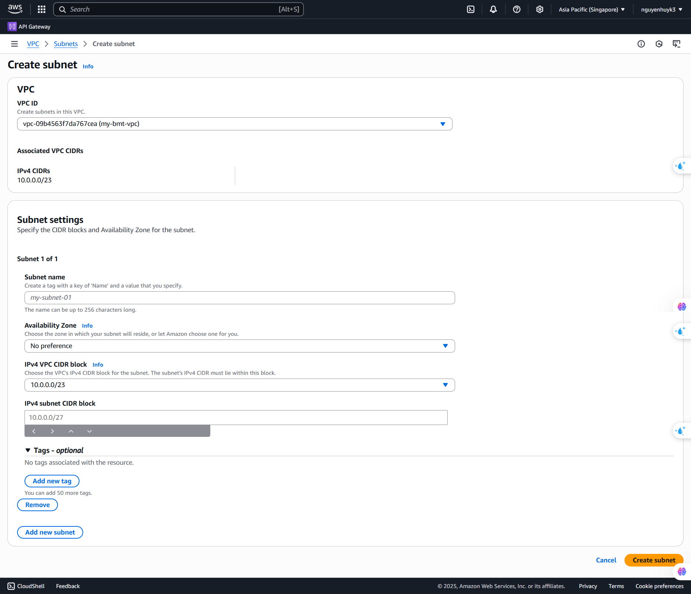
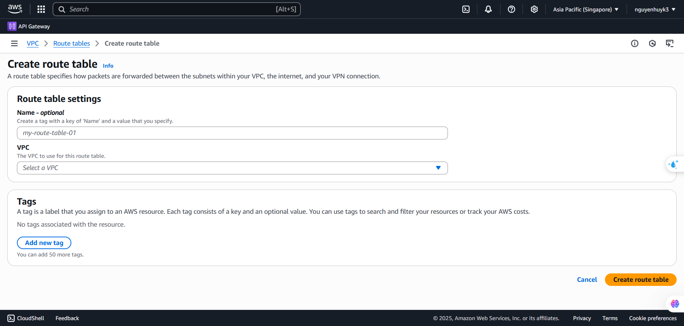
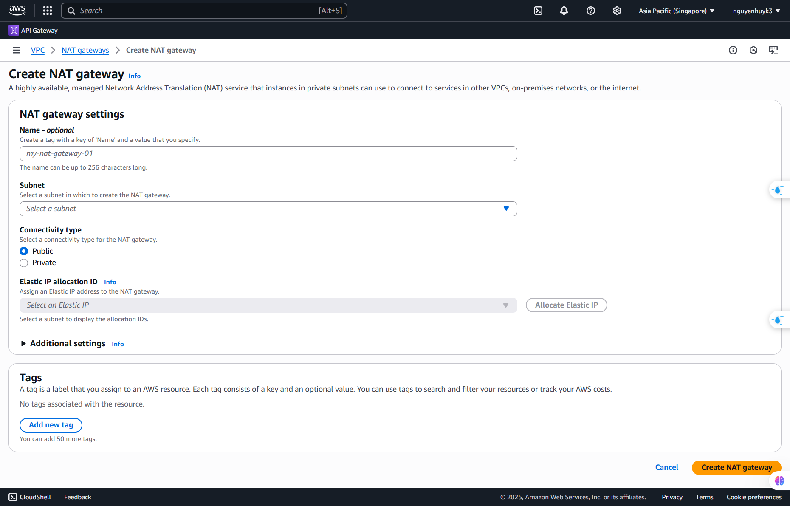
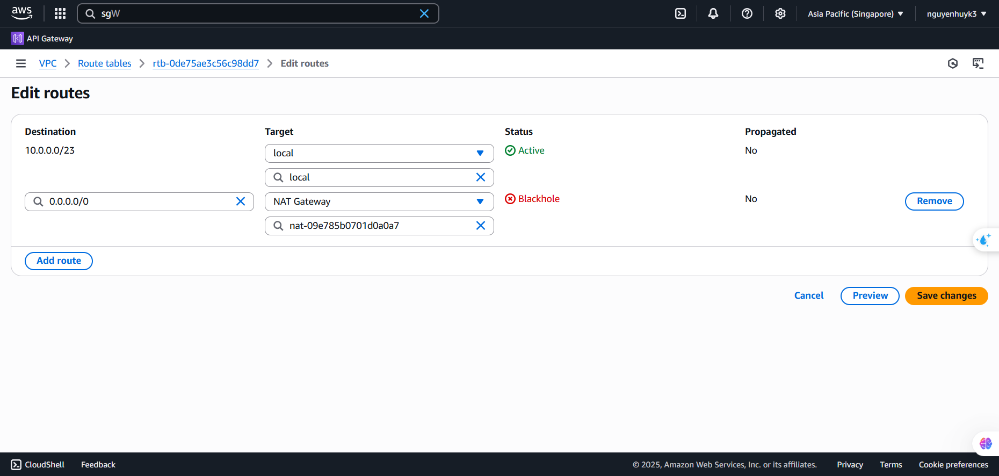

**Nội dung:**
- [Tạo VPC](#tạo-vpc)
- [Tạo subnets](#tạo-subnets)
- [Tạo Route tables](#tạo-route-tables)
- [Tạo NAT gateway](#tạo-nat-gateway)
- [Kết quả](#kết-quả)

---

### Tạo VPC

1. Vào **VPC Console**.
2. Chọn region, ví dụ: (ap-southeast-1).
3. Nhấn vào **Create VPC**.
4. Chọn CIDR và chọn CIDR là 10.0.0.0/23
5. Nhấn vào **Create PVC** để hoàn thành.



---

### Tạo subnets

1. Chúng ta sẽ tạo 8 subnets.
2. 2 public subnets để cho client có thể thực hiện các cuộc gọi APIs.
3. 2 private application subnets nơi các services sẽ được đặt.
4. 2 private middleware subnets nơi để chạy MSK, Elasticache, Debezium (EC2).
5. 2 private database subnet nơi đặt các database của các services. 


```json
{ 
  "public_subnets": [
    {
      "name": "my-public-subnet-a-1a",
      "availability_zone": "ap-southeast-1a",
      "ipv4_cidr": "10.0.0.0/26"
    },
    {
      "name": "my-public-subnet-b-1b",
      "availability_zone": "ap-southeast-1b",
      "ipv4_cidr": "10.0.0.64/26"
    },
  ],
  "private_application_subnets": [
    {
      "name": "my-private-application-subnet-a-1b",
      "availability_zone": "ap-southeast-1b",
      "ipv4_cidr": "10.0.0.128/26"
    },
    {
      "name": "my-private-application-subnet-b-1c",
      "availability_zone": "ap-southeast-1c",
      "ipv4_cidr": "10.0.0.192/26"
    },
  ],
  "private_middleware_subnets": [
    {
      "name": "my-private-middleware-subnet-b-1c",
      "availability_zone": "ap-southeast-1c",
      "ipv4_cidr": "10.0.1.64/26"
    },
    {
      "name": "my-private-middleware-subnet-a-1b",
      "availability_zone": "ap-southeast-1b",
      "ipv4_cidr": "10.0.1.0/26"
    },
  ],
   "private_database_subnets": [
    {
      "name": "my-private-database-subnet-a-1a",
      "availability_zone": "ap-southeast-1a",
      "ipv4_cidr": "10.0.1.128/26"
    },
    {
      "name": "my-private-database-subnet-a-1c",
      "availability_zone": "ap-southeast-1c",
      "ipv4_cidr": "10.0.1.192/26"
    },
  ],
}
```


### Tạo Route tables

1. Chúng ta sẽ tạo 2 route tables.
2. Tạo 1 route table tên là public_route (các public subnets sẽ sử dụng route table này).
3. Tạo 1 route table tên là private_route (các private subnets sẽ sử dụng route table nay).
4. private_route sẽ không có route cho Destion là 0.0.0.0/0 đến target là Internet gateway. Chúng ta sẽ chỉ cho các tài nguyên trong private subnets giao tiếp với internet thông qua NAT gateway.
4. Đưa các subnets phù hợp vào route table.



---

### Tạo NAT gateway

1. Vào **VPC Console**.
2. Select **NAT gateways** → **Create NAT gateway**.
3. Đặt tên
4. Chọn subnet (Chọn subnet có route table không có Destination là 0.0.0.0/0 và có target là Internet gateway hay đó chính là private subnet).
5. Chỉnh sửa **Route table** của private subnet.



  

---

### Kết quả

Bây giờ chúng ta đã hoàn thành việc tạo mạng thành công để chúng ta có thể tách biệt các tài nguyên vào các subnet khác nhau

- Kong gatewway, bastion host sẽ nằm ở **public subnets**.
- Các ứng dụng backend sẽ nằm ở **private application subnet**.
- MSK, Elasticache, Debezium (EC2) sẽ nằm ở **private middleware subnet**.
- RDS sẽ nằm ở **private database subnet**. 

Đây là bước đầu tiên để chúng ta có thể xây dựng 1 kiến trúc hướng sự kiện trên AWS.