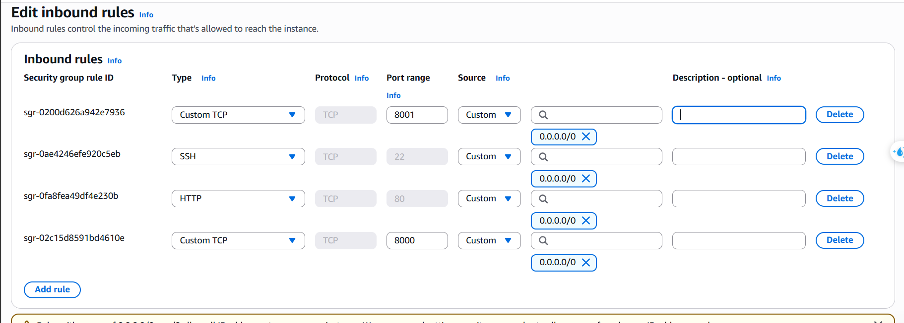

**Nội dung:**

- [Tổng quan](#tổng-quan)
- [Định nghĩa](#định-nghĩa)
- [Tạo Kong gateway](#tạo-kong-gateway)
- [Tạo Bastionhost](#tạo-bastionhost)
- [Cài đặt Kong gateway](#cài-đặt-kong-gateway)
- [Tổng kết](#-tổng-kết)

---

### Tổng quan

Trong bước này chúng ta sẽ xây dựng các ứng dụng ở **Public Subnet**:

- **Kong gateway** (đây là cửa ngỏ để client giao tiếp với các ứng dụng ở private application subnet mà không giao tiếp trực tiếp với các ứng dụng ở private application subnet).
- **Bastion host** (đây là 1 EC2 instance để chúng ta có thể truy cập gián tiếp vào các tài nguyên trong private subnets, vì các tài nguyên trong private subnets sẽ không có **public ip**, hay cũng sẽ có **security group** không cho truy cập từ bên ngoài vào).

---

### Định nghĩa

- **Kong Gateway**: là một thành phần trung gian nằm giữa client và các backend service, có vai trò như một "cổng ra vào" (gateway). Nó nhận request từ phía client, rồi định tuyến, xác thực, ghi log, và chuyển tiếp đến service nội bộ tương ứng.

- **Bastion host**: là một EC2 instance đặc biệt, đóng vai trò như một cửa ngõ (gateway) để bạn có thể truy cập SSH vào các instance nằm trong private subnet – những máy mà không có IP public và không thể truy cập trực tiếp từ Internet.

---

### Tạo Kong gateway

1. Đi vào **EC2** console.
2. Nhấn vào **Launch instance**.
3. Đặt tên (kong_gateway).
4. Chúng ta nên tạo Key pair (đặt tên là kong_gateway).
5. Chọn VPC (VPC mà chúng ta đã tạo ở bước trước).
6. Đặt instance này ở public subnet.
7. Tạo mới **Sercurity group** mới (đăt tên là kong_gateway_sg) và chúng ta nên sửa đổi **Sercurity group** này như trong ảnh. Tôi khuyên bạn nên chỉ cho phép cổng 8001 được truy cập bởi 1 số ip nhất định.



8. Và cuối cùng là nhấn Launch instance.

### Giải thích

- **Cổng 8000**: Đây là cổng chính mà client (người dùng cuối hoặc ứng dụng bên ngoài) sử dụng để gửi các yêu cầu đến các dịch vụ backend trong private application subnet.
- **Cổng 8001**: Đây là cổng cho phép bạn quản lý cấu hình của Kong, như thêm/xoá/định nghĩa các route, service, plugin...


---

### Tạo Bastionhost

1. Đi vào **EC2** console.
2. Nhấn vào **Launch instance**.
3. Đặt tên (bastion_host).
4. Chúng ta nên tạo Key pair (đặt tên là bastion_host).
5. Chọn VPC (VPC mà chúng ta đã tạo ở bước trước).
6. Đặt instance này ở public subnet.
7. Tạo mới **Sercurity group** mới (đăt tên là bastion_host_sg) và chúng ta chỉ mở cổng 22 để chúng ta có thể SSH vào instance này. Và cũng giống như **kong_gateway** thì ta cũng nên để cổng 22 được truy cập bởi 1 số ip nhất định.
8. Và cuối cùng là nhấn Launch instance.

---

### Cài đặt Kong gateway


1. SSH vào EC2 có tên là kong_gateway.
2. Cài đặt Docker.

```bash
# Cập nhật hệ thống
sudo dnf update -y

# Cài đặt Docker
sudo dnf install docker -y

# Khởi động Docker service
sudo systemctl start docker
sudo systemctl enable docker

# Thêm user vào docker group
sudo usermod -a -G docker ec2-user

# Logout và login lại để áp dụng thay đổi group
exit
```

3. Cài đặt Docker Compose.

```bash
# Cài đặt Docker Compose
sudo curl -L "https://github.com/docker/compose/releases/latest/download/docker-compose-$(uname -s)-$(uname -m)" -o /usr/local/bin/docker-compose
sudo chmod +x /usr/local/bin/docker-compose
```

4. Tạo file docker-compose bằng câu lệnh **nano docker-compose.yml**.

```yaml
version: '3.8'

services:
  # PostgreSQL Database cho Kong
  kong-database:
    image: postgres:13
    container_name: kong-database
    environment:
      POSTGRES_USER: kong
      POSTGRES_PASSWORD: kong
      POSTGRES_DB: kong
    ports:
      - "5432:5432"
    volumes:
      - kong_data:/var/lib/postgresql/data
    networks:
      - kong-net
    restart: unless-stopped

  # Kong Database Migration
  kong-migration:
    image: kong/kong-gateway:3.4
    container_name: kong-migration
    command: "kong migrations bootstrap"
    environment:
      KONG_DATABASE: postgres
      KONG_PG_HOST: kong-database
      KONG_PG_USER: kong
      KONG_PG_PASSWORD: kong
      KONG_PG_DATABASE: kong
    depends_on:
      - kong-database
    networks:
      - kong-net
    restart: on-failure

  # Kong Gateway
  kong:
    image: kong/kong-gateway:3.4
    container_name: kong-gateway
    environment:
      KONG_DATABASE: postgres
      KONG_PG_HOST: kong-database
      KONG_PG_USER: kong
      KONG_PG_PASSWORD: kong
      KONG_PG_DATABASE: kong
      KONG_PROXY_ACCESS_LOG: /dev/stdout
      KONG_ADMIN_ACCESS_LOG: /dev/stdout
      KONG_PROXY_ERROR_LOG: /dev/stderr
      KONG_ADMIN_ERROR_LOG: /dev/stderr
      KONG_ADMIN_LISTEN: 0.0.0.0:8001
      KONG_ADMIN_GUI_URL: http://localhost:8002
    ports:
      - "8000:8000"   # Proxy port HTTP
      - "8001:8001"   # Admin API port
      - "8443:8443"   # Proxy port HTTPS
      - "8444:8444"   # Admin API HTTPS port
      - "8002:8002"   # Kong Manager (GUI)
    depends_on:
      - kong-migration
    networks:
      - kong-net
    restart: unless-stopped

volumes:
  kong_data:

networks:
  kong-net:
    driver: bridge
```

5. Khởi động Kong gateway

```bash
# Khởi động các container
docker-compose up -d

# Kiểm tra trạng thái containers
docker-compose ps

# Xem logs nếu cần
docker-compose logs kong
```

6. Xác nhận cài đặt
```bash
# Kiểm tra Kong Admin API
curl -i http://localhost:8001/

# Kiểm tra Kong Proxy
curl -i http://localhost:8000/
```
---

### Tổng kết

Trong bước này, chúng ta đã thiết lập được hai thành phần quan trọng trong Public Subnet của kiến trúc mạng AWS:

- **Kong Gateway**: đóng vai trò như một API Gateway, giúp quản lý và định tuyến các request từ client tới các dịch vụ backend nằm trong Private Subnet một cách an toàn và linh hoạt. Việc cài đặt Kong bằng Docker và Docker Compose giúp quá trình triển khai dễ dàng, nhanh chóng và có thể tái sử dụng.

- **Bastion Host**: cho phép chúng ta truy cập các EC2 instance trong Private Subnet thông qua SSH một cách gián tiếp, đảm bảo nguyên tắc zero trust trong bảo mật mạng.

Việc cấu hình đúng Security Group, Subnet, và hiểu vai trò từng thành phần là điều then chốt giúp hệ thống của bạn vừa bảo mật vừa dễ dàng mở rộng trong tương lai.