**Nội dung:**

- [Tổng quan](#tổng-quan)
- [Định nghĩa](#định-nghĩa)
- [Tạo RDS PostgreSQL (No replication)](#tạo-rds-postgresql-no-replication)
- [Tạo RDS PostgreSQL Replication](#tạo-rds-postgresql-replication)
- [Chỉnh sửa Security group của cho các Database ở Private Database Subnet](#chỉnh-sửa-security-group-của-cho-các-database-ở-private-database-subnet)

### Tổng quan

Trong bước này chúng ta sẽ xây dựng các database ở **Private Database Subnet** và database chúng ta sử dụng cho bài thực hành này là **PostgreSQL**.

---

### Định nghĩa

- **Amazon RDS (Relational Database Service)**: một dịch vụ cơ sở dữ liệu quan hệ được quản lý của AWS, giúp bạn dễ dàng thiết lập, vận hành và mở rộng một cơ sở dữ liệu quan hệ trên đám mây mà không cần phải tự quản lý hạ tầng máy chủ, backup, patch, replication, scaling....
- **Logical replication**: Logical Replication trong PostgreSQL là một cơ chế sao chép dữ liệu dựa trên các thay đổi logic (thao tác INSERT/UPDATE/DELETE) của dữ liệu (row-level), thay vì sao chép toàn bộ khối dữ liệu vật lý (physical block changes) như Physical Replication (Streaming Replication). Nó cho phép sao chép có chọn lọc một hoặc nhiều bảng (table-level) giữa các PostgreSQL database.

---

### Tạo RDS PostgreSQL No Replication

1. Đi vào **RDS** console.
2. Nhấn vào **Create database**.
3. Thực hiện cấu hình theo như trong ảnh.

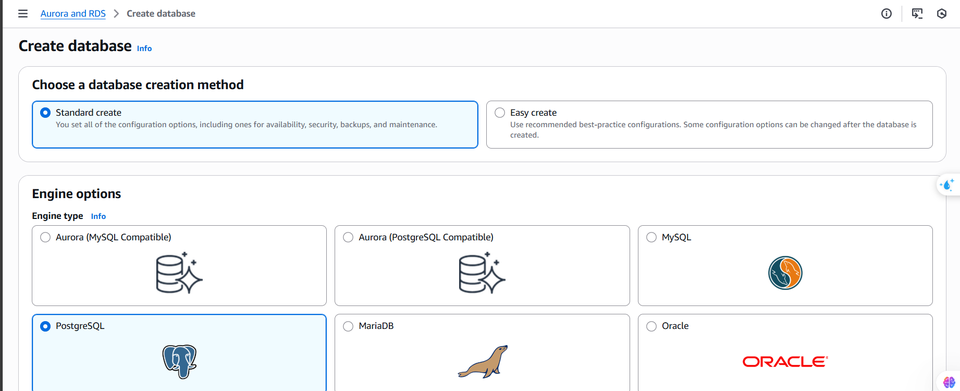
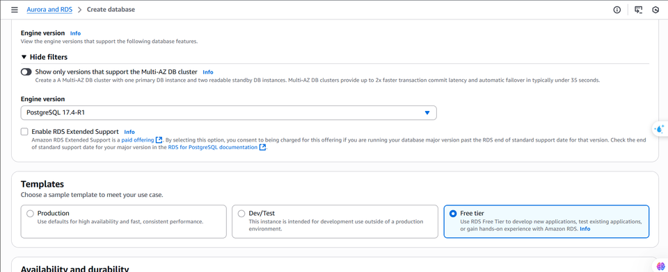
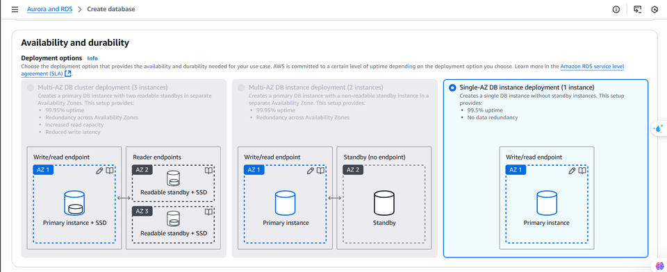
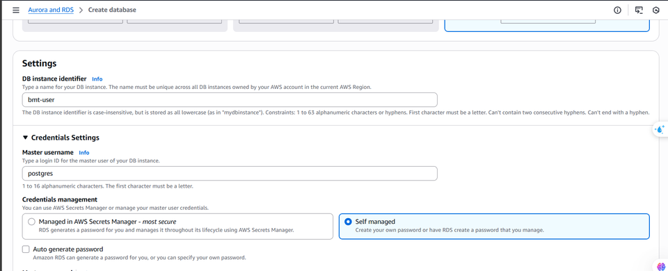
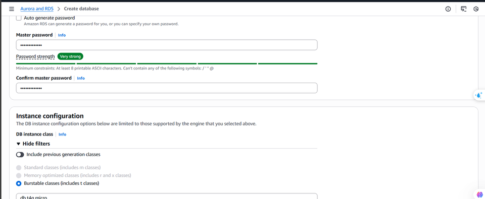
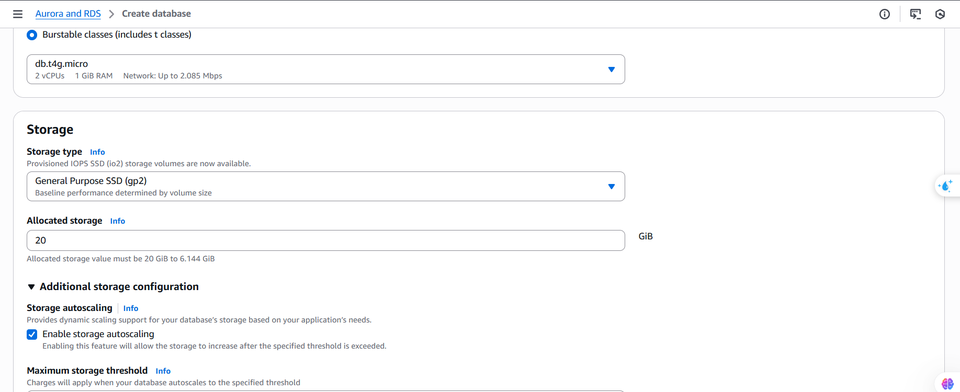
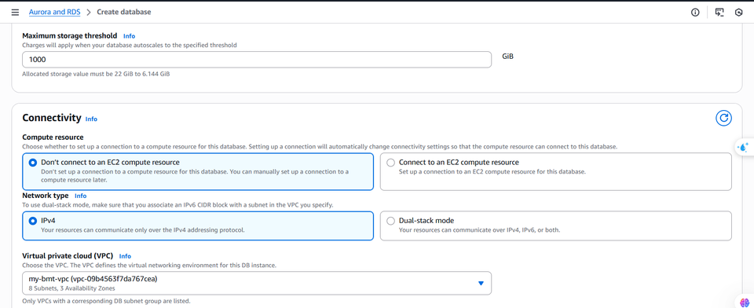
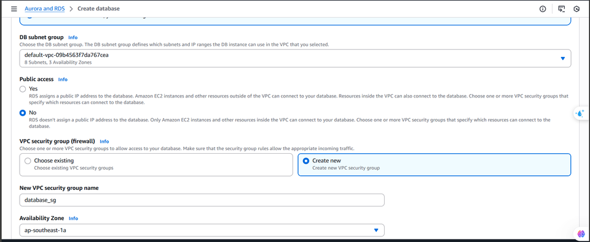
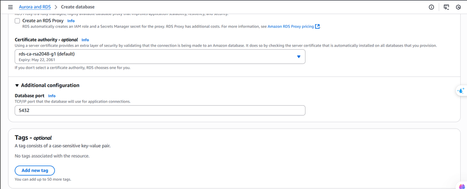
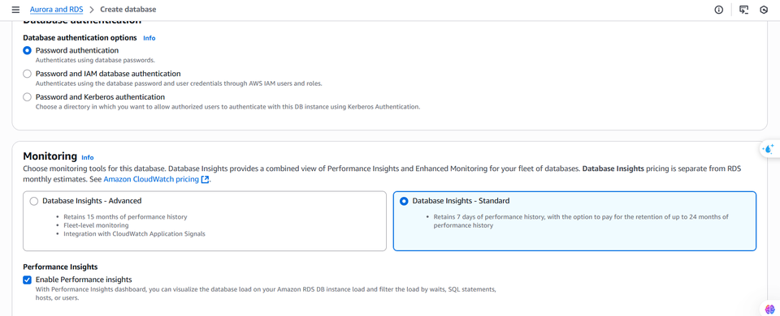
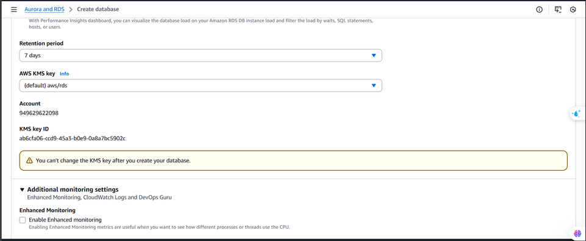
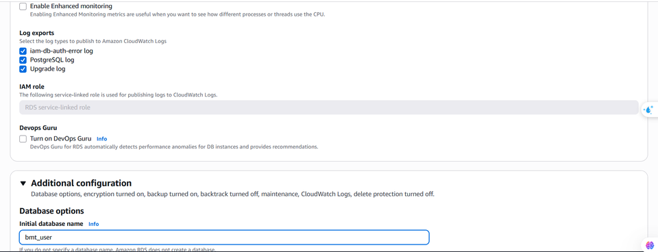

4. Và cuối cùng nhấn vào **Create database**.
  
**Chúng ta sẽ tạo các database tên là bmt_user, bmt_product, bmt_showtime với cấu hình như trên**.

---

### Tạo RDS PostgreSQL Replication

1. Đi vào **RDS** console.
2. Đi vào **Dashboard** -> **Parameter groups**.
3. Nhấn vào **Create parameter group**.
4. Tạo **Parameter group** với **Engine Type** là **PostgreSQL** và **Parameter group family** là **postgres17**.
5. Nhấn vào **Create**.
6. Sau đó ta sẽ chỉnh sửa 1 số **Parameters** của **Parameter group** vừa mới tạo.

| Tham số                   | Giá trị                  | Ghi chú                                          |
|---------------------------|--------------------------| ------------------------------------------------ |
| wal_level                 | logical                  | Bắt buộc để hỗ trợ logical replication           |
| max_replication_slots     | 4 hoặc cao hơn           | Số slot replication Debezium có thể sử dụng      |
| max_wal_senders           | 4 hoặc cao hơn           | Cho phép bao nhiêu tiến trình gửi WAL            |
| wal_keep_size             | 512MB (hoặc nhiều hơn)   | Giữ WAL lâu hơn đề phòng Debezium chậm đọc       |
| track_commit_timestamp    | on                       | (nếu bạn cần tính toán độ trễ, không bắt buộc)   | 

7. Chúng ta sẽ tạo database cùng với cấu hình như trước nhưng chỉ khác ở cấu hình 

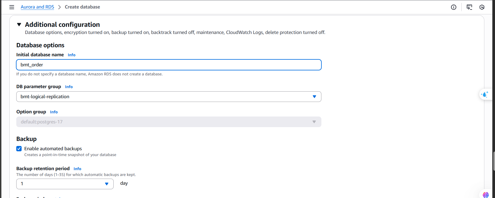

8. Cuối cùng là nhấn vào **Create database**.

**Chúng ta sẽ tiếp tục tạo các database tên là bmt_order, bmt_payment với cấu hình như trước và với Parameter group đã tạo**.

### Chỉnh sửa Security group của cho các Database ở Private Database Subnet

Vì các databse cũng chỉ sử dụng chung 1 **Security group** nên ta sẽ chỉnh sửa như bên dưới.

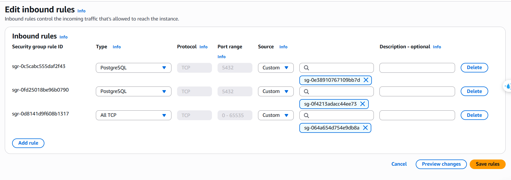

#### Tại sao lại có bước này?

Chúng ta cần phải thực hiện bước này để cho các ứng dụng ở subnet khác có thể truy cập vào PostgreSQL ở cổng 5432.

- Chúng ta cần phải mở cổng 5432 cho **Security group** của **Bastion host** để chúng ta có thể truy cập vào database xem dữ liệu. 
- Chúng ta cũng cần phải mở cổng 5432 cho **Security group** của các ứng dụng backend được triển khai ở **Private application subnet** để ứng dụng backend có thể truy cập vào database để thực hiện các tác vụ CRUD.

###  Kết quả mong đợi

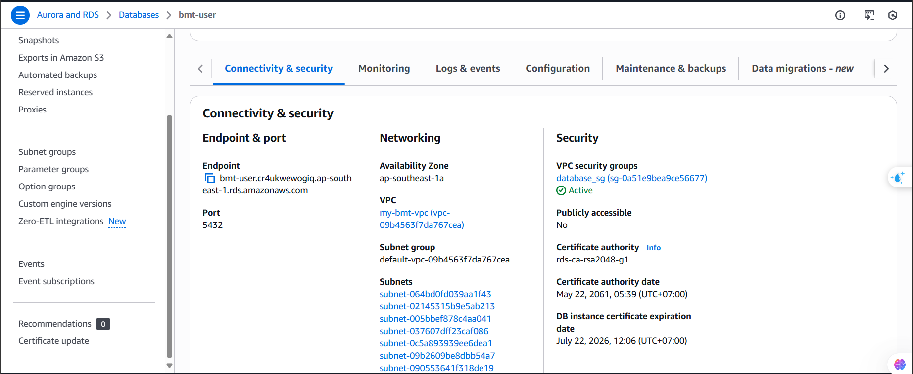

Sau khi tạo **RDS** thì chúng ta phải đợi từ 5 tới 10 phút để cho việc tạo tài nguyên hoàn tất. Chúng ta sẽ cần lấy **Endpoint** và cần phải nhớ **Password** và **Master username** chúng ta đã đặt khi tạo **RDS**. 

---

