**Nội dung:**
- [Tổng quan](#tổng-quan)
- [Định nghĩa](#định-nghĩa)
- [Tại sao ta nên sử dụng MSK?](#tại-sao-ta-nên-sử-dụng-msk)
- [Chỉnh sửa Security group cho các tài nguyên trong Private Middleware Subnet](#chỉnh-sửa-security-group-cho-các-tài-nguyên-trong-private-middleware-subnet)
- [Tạo MSK](#tạo-msk)
- [Tạo Elasticache](#tạo-rds-postgresql-replication)
- [Cài đặt Debezium](#chỉnh-sửa-security-group-của-cho-các-database-ở-private-database-subnet)
- [Truy cập vào MSK](#truy-cập-vào-msk)
- [Tổng kết](#-tổng-kết)

### Tổng quan

Trong bước này chúng ta sẽ tạo các tài nguyên và đặt chúng nằm ở **Private Middleware Subnet**. Và chúng ta có thể truy cập **MSK** thông qua **Bastion host**.

---

### Định nghĩa
- **Amazon ElastiCache**: một dịch vụ caching (bộ nhớ đệm) được quản lý hoàn toàn (fully managed) trong AWS, giúp tạo, vận hành và mở rộng các kho lưu trữ dữ liệu trong bộ nhớ (in-memory data store) một cách dễ dàng và hiệu quả. Mục tiêu chính của nó là cải thiện hiệu suất ứng dụng bằng cách giảm tải cho cơ sở dữ liệu chính (database) và cung cấp khả năng truy xuất dữ liệu cực nhanh.
- **Amazon MSK (Managed Streaming for Apache Kafka)**: dịch vụ quản lý hoàn toàn (fully managed) của AWS giúp bạn triển khai, vận hành và mở rộng các cluster Apache Kafka để xử lý dữ liệu streaming (luồng dữ liệu) thời gian thực mà không cần tự quản lý cơ sở hạ tầng phức tạp của Kafka.
- **Debezium**: một công cụ nguồn mở (open-source) chuyên dụng cho Change Data Capture (CDC), giúp theo dõi và ghi lại mọi thay đổi dữ liệu (INSERT, UPDATE, DELETE) trong cơ sở dữ liệu quan hệ theo thời gian thực, sau đó phát chúng dưới dạng sự kiện (events) đến các hệ thống streaming như Apache Kafka.

---

### Tại sao ta nên sử dụng MSK?
Việc triển khai Kafka trên AWS giúp chúng ta giải quyết được những vấn đề sau:
- Triển khai Kafka thủ công đòi hỏi kiến thức sâu, tốn công vận hành (cài đặt, cấu hình, giám sát, vá lỗi, scaling...). MSK tự động hóa các tác vụ này, giúp bạn tập trung vào xử lý dữ liệu thay vì quản lý hạ tầng.
- **Fully Managed**: AWS tự động cài đặt, vá lỗi, backup, monitoring (qua CloudWatch), nâng cấp phiên bản Kafka.
- **High Availability**: Triển khai Multi-AZ, tự động phục hồi node lỗi, đảm bảo độ tin cậy 99.9%.
- **Security**: 	Hỗ trợ mã hóa dữ liệu (in-transit/at-rest), VPC, IAM, SSL/TLS, SASL/SCRAM.
- **Scalability**: Thêm/bớt broker, thay đổi loại instance, tự động cân bằng tải (auto rebalance partitions).
- **Tương thích Kafka**: 	Sử dụng client Kafka chuẩn, hỗ trợ Kafka Connect, MirrorMaker, Schema Registry.
- **Serverless Option (MSK Serverless)**: Không cần quản lý capacity, tự động scale dựa trên lưu lượng, trả tiền theo sử dụng.

### Chỉnh sửa Security group cho các tài nguyên trong Private Middleware Subnet

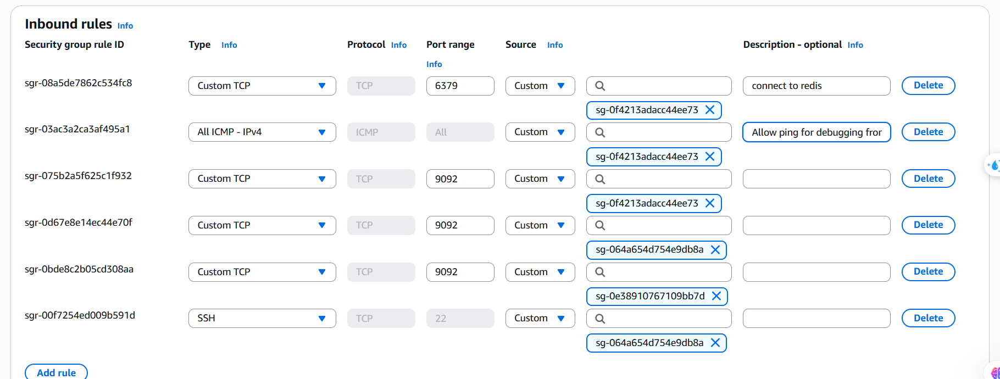

Giải thích:
- **PORT 6379**: Chúng ta sẽ cho phép **Security group** của các tài nguyên trong **Private Application Subnet** có thể kết nối tới **Elasticache** của chúng ta.
- **PORT 9092**: Chúng ta sẽ cho phép **Security group** của các tài nguyên trong **Private Application Subnet**, **Bastion host** (để có thể thực hiện 1 số các vụ như xem Topic, tạo Topic,...), và cuối cùng là cho phép **Debezium** nằm trong cùng subnet có thể kết nối tới **MSK**.

---

### Tạo MSK
1. Đi vào **Amazon MSK** console.
2. Nhấn vào **Create MSK**.

**Bước 1**
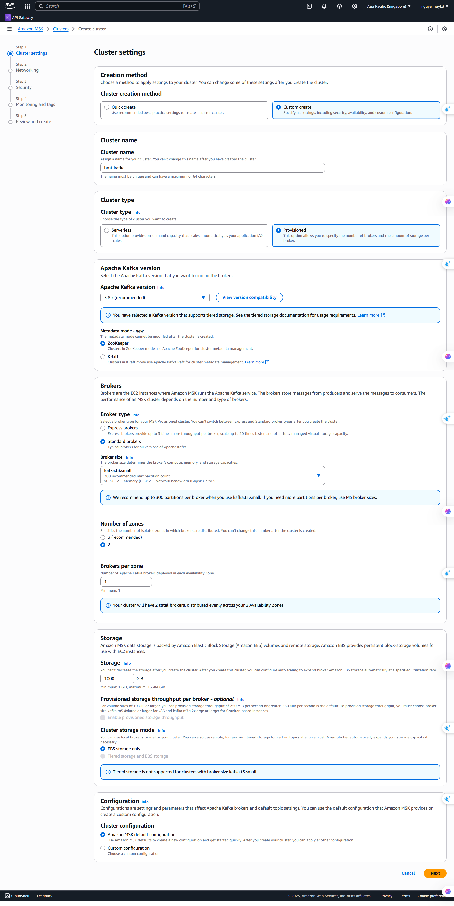
**Bước 2**
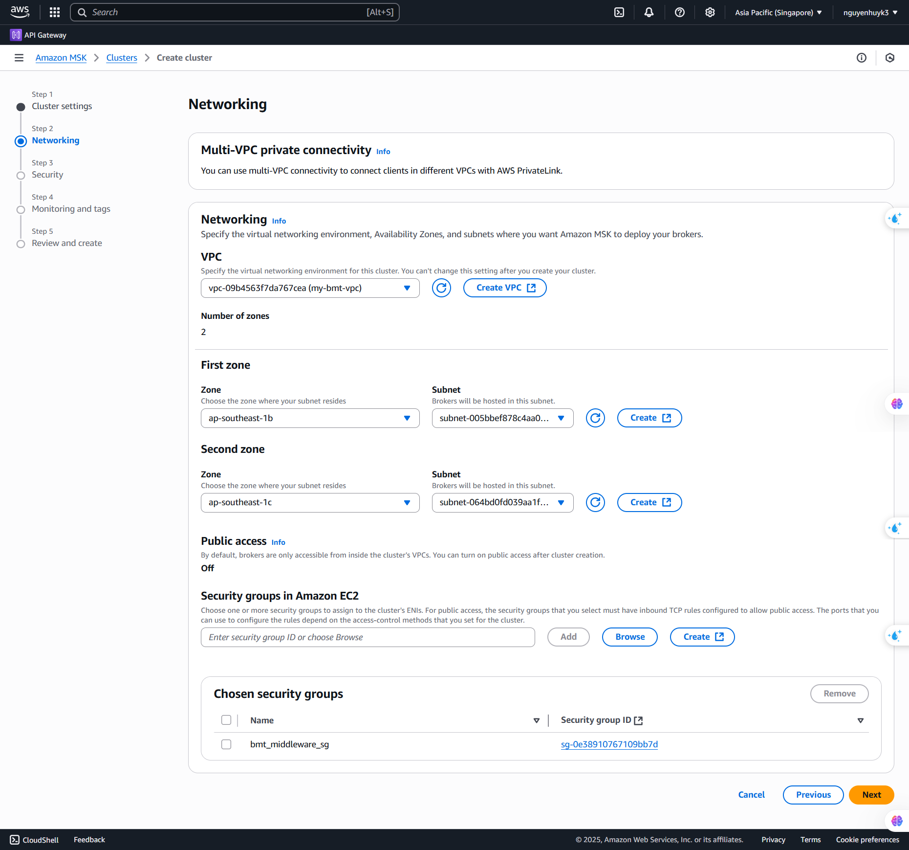
**Bước 3**
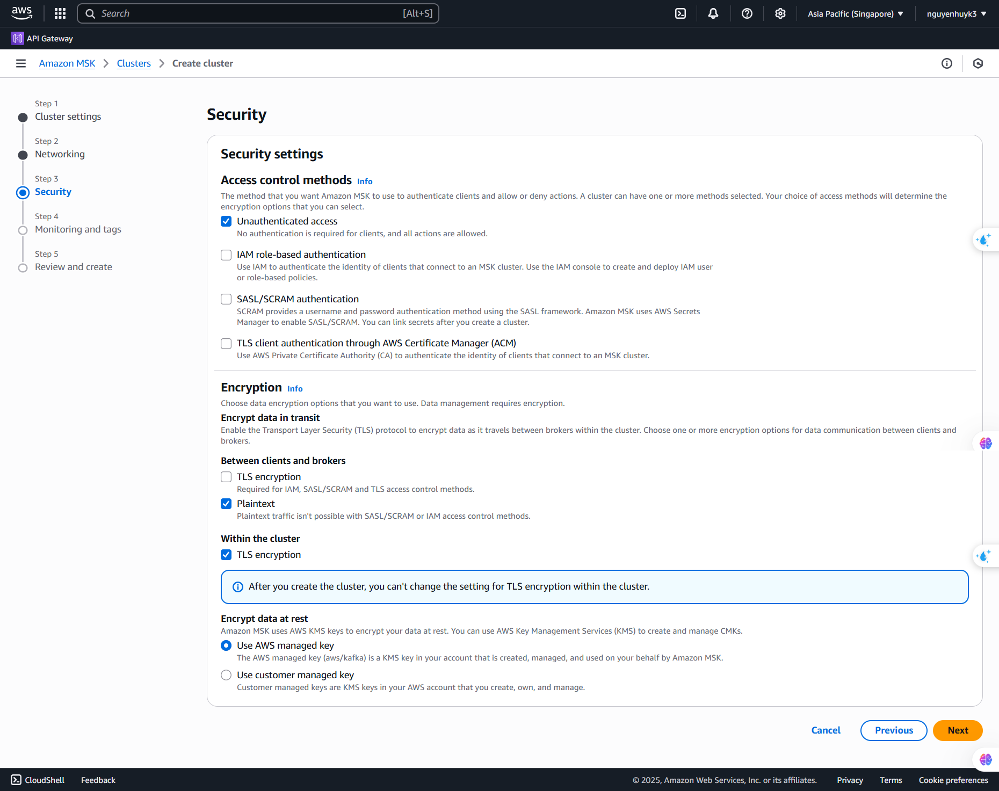

3. 2 bước còn lại thì để mặc định.
4. Nhấn vào **Create cluster**.

### Tạo Elasticache
1. Đi vào **Elasticache Dashboard**.
2. Chọn **Redis OSS caches** -> **Create cache**.
3. Chọn cấu hình như trong ảnh.

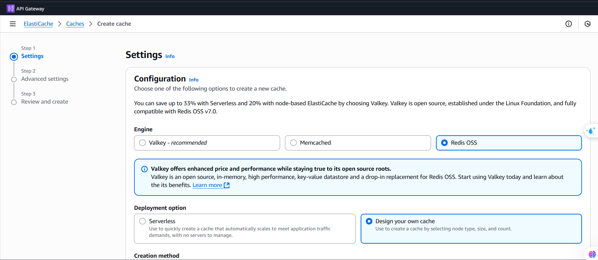
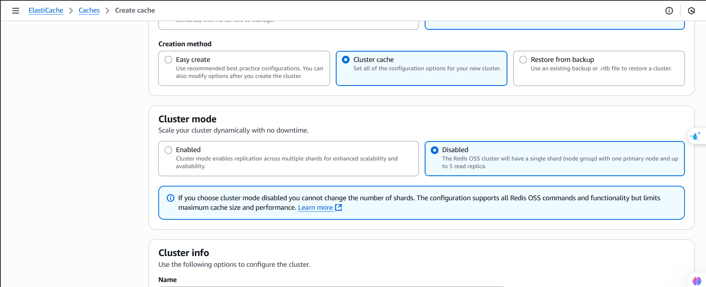
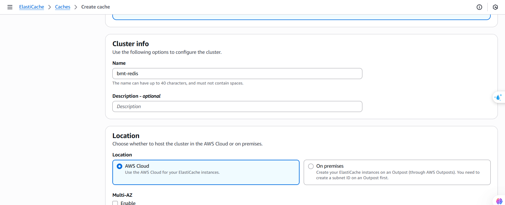
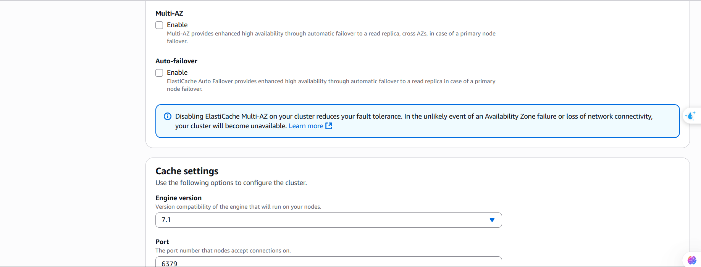
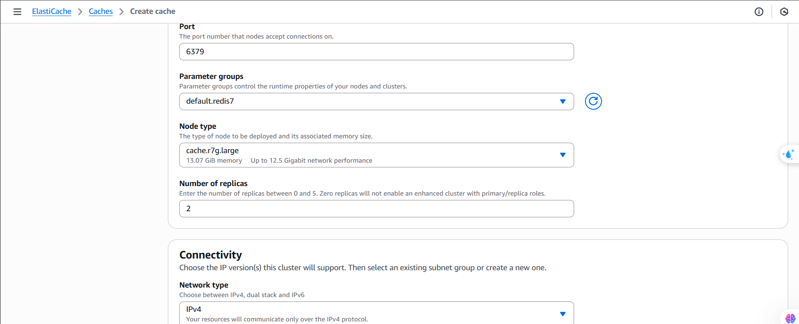
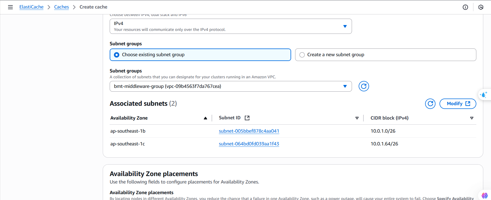


4. Ở **Step 2** chúng ta sẽ để tất cả các tùy chọn mặc định và sẽ chọn **Security Group** giống như khi tạo **MSK**.
5. Ở **Step 3** nhấn vào **Create**.

### Cài đặt Debezium
1. Đi vào **EC2** console.
2. Nhấn vào **Launch instance**.
3. Đặt tên (debezium).
4. Chúng ta nên tạo Key pair (đặt tên là debezium).
5. Chọn VPC (VPC mà chúng ta đã tạo ở bước trước).
6. Đặt instance này ở private middleware subnet.
7. Chọn **Security Group** cho **Instance** này giống như khi tạo **Elasticache**.

Sau khi tạo xong **EC2 Instance** cho **Debezium** thì chúng ta sẽ SSH vào instance này thông qua **Bastion host** và thực hiện 1 số cài đặt. 
Sau khoảng 10-20 phút thì quá trình tạo **MSK** sẽ hoàn tất và chúng ta sẽ cần truy cập vào **MSK** để lấy thông tin về **Bootstrap Server** và trong hình ảnh thì ta sẽ lấy thông tin từ **Private endpoint (single-VPC)**.

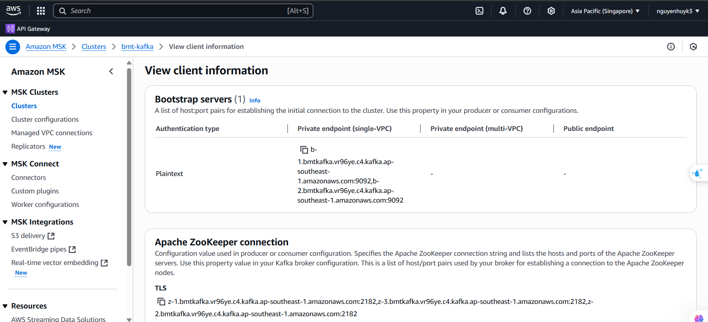

````bash
# Cập nhật hệ thống
sudo dnf update -y

# Cài đặt Java 11 hoặc 17 (Debezium yêu cầu)
sudo dnf install -y java-11-openjdk java-11-openjdk-devel

# Kiểm tra Java version
java -version
````

**Tạo file docker-compose.yml** bằng cú pháp **nano docker-compose.yml**.

````yaml
version: '2'
services:
  debezium:
    image: debezium/connect:2.6
    container_name: debezium
    ports:
      - "8083:8083"
    environment:
      BOOTSTRAP_SERVERS: <YOUR_BOOTSTRAP_SERVERS>      
      GROUP_ID: debezium-connect-cluster
      CONFIG_STORAGE_TOPIC: debezium_connect_configs
      OFFSET_STORAGE_TOPIC: debezium_connect_offsets
      STATUS_STORAGE_TOPIC: debezium_connect_statuses
      KEY_CONVERTER: org.apache.kafka.connect.json.JsonConverter
      VALUE_CONVERTER: org.apache.kafka.connect.json.JsonConverter
      INTERNAL_KEY_CONVERTER: org.apache.kafka.connect.json.JsonConverter
      INTERNAL_VALUE_CONVERTER: org.apache.kafka.connect.json.JsonConverter
      PLUGIN_PATH: /kafka/connect,/debezium-plugins
      CONNECT_REST_ADVERTISED_HOST_NAME: debezium
      CONNECT_GROUP_ID: debezium-connect-cluster
      CONNECT_CONFIG_STORAGE_REPLICATION_FACTOR: 1
      CONNECT_OFFSET_STORAGE_REPLICATION_FACTOR: 1
      CONNECT_STATUS_STORAGE_REPLICATION_FACTOR: 1
      CONNECT_PLUGIN_PATH: /kafka/connect,/debezium-plugins
      CONNECT_LOG4J_ROOT_LOGLEVEL: INFO
    volumes:
       volumes:
      - /tmp/debezium-data:/kafka/data
    restart: unless-stopped
````

Chúng ta sẽ thực hiện API này để đăng ký một Connector. Và chúng ta sẽ đăng kí các connector cho **bmt_order**, **bmt_payment** database. Và điều quan trọng là trọng là khi tạo database thì chúng ta phải chạy câu lệnh **CREATE PUBLICATION order_dbz_publication FOR TABLE outboxes;**. Và trong ứng dụng backend của tôi đã có script tự động tạo database và cũng có thực hiện câu lệnh **CREATE PUBLICATION order_dbz_publication FOR TABLE outboxes;**.

Giải thích câu lệnh **CREATE PUBLICATION order_dbz_publication FOR TABLE outboxes;**:
- **CREATE PUBLICATION**: Tạo một publication mới (một nhóm các bảng được theo dõi thay đổi).
- **order_dbz_publication**: 	Tên của publication bạn tự đặt.
- **FOR TABLE outboxes**: Chỉ định bảng outboxes sẽ được đưa vào publication (theo dõi thay đổi INSERT/UPDATE/DELETE).

````bash
curl -X POST http://localhost:8083/connectors \
  -H "Content-Type: application/json" \
  -d '{
  "name": "YOUR_CONNECTOR_NAME",
  "config": {
    "connector.class": "io.debezium.connector.postgresql.PostgresConnector",
    "database.hostname": "your-db-host",
    "database.port": "5432",
    "database.user": "youruser",
    "database.password": "yourpassword",
    "database.dbname": "yourdbname",
    "database.server.name": "pgserver1",
    "plugin.name": "pgoutput",
    "slot.name": "debezium",
    "publication.name": "debezium_pub",
    "table.include.list": "public.users",
    "tombstones.on.delete": "false"
  }
}'
````

Sau khi thực hiện API trên thì Debezium sẽ tự động tạo Kafka topic theo cú pháp: **&lt;topic.prefix&gt;.&lt;schema&gt;.&lt;table&gt;**
. Và sau khi đăng kí các connectors thì chúng ta sẽ xem danh sách các connectors bằng câu lệnh **curl http://localhost:8083/connectors**.

---

### Truy cập vào MSK

Để có thể truy cập vào **MSK** chúng ta nên truy cập thông qua **Bastion host**. Chúng ta sẽ SSH vào **Bastion host**. Và thực hiện câu lệnh bên dưới. 

```bash
# Tải Kafka 3.6.0 và giải nén nó ra thư mục hiện tại
curl https://downloads.apache.org/kafka/3.6.0/kafka_2.13-3.6.0.tgz | tar -xz
```

Và khi muốn truy cập vào **MSK** thì chúng ta cần phải thực hiện câu lệnh **cd kafka_2.13-3.6.0**. Để xem các **Topic** trong **MSK** thì chúng ta thực hiện câu lệnh **bin/kafka-topics.sh --bootstrap-server <YOUR_BOOTSTRAP_SERVER>:9092 --list**. Nếu không có **Topic** nào có dạng **&lt;topic.prefix&gt;.&lt;schema&gt;.&lt;table&gt;**. Lí do là **MSK** mặc định không tự tạo topic, nếu chúng ta không bật auto.create.topics.enable trên broker. Và chúng ta sẽ tạo thủ công với câu lệnh:

````bash
./bin/kafka-topics.sh --create --bootstrap-server <YOUR_BOOTSTRAP_SERVER>:9092 --topic bmt_payment.public.outboxes --partitions 1 --replication-factor 2
````

Sau đó chúng ta sẽ kiểm tra lại và sẽ thấy các **Topic** với dạng **&lt;topic.prefix&gt;.&lt;schema&gt;.&lt;table&gt;**
.

---

### Tổng kết

Trong bước này, chúng ta đã triển khai thành công các tài nguyên quan trọng nằm trong Private Middleware Subnet, bao gồm:

- **Amazon MSK (Managed Streaming for Apache Kafka)**: Giải pháp xử lý dữ liệu dạng luồng (streaming) được quản lý hoàn toàn, giúp giảm tải việc vận hành hạ tầng Kafka thủ công.
- **Amazon ElastiCache (Redis)**: Dịch vụ bộ nhớ đệm giúp tăng tốc độ truy xuất dữ liệu và giảm tải cho cơ sở dữ liệu chính.
- **Debezium**: Công cụ CDC (Change Data Capture) giúp phát hiện và đẩy các thay đổi dữ liệu từ cơ sở dữ liệu PostgreSQL lên Kafka.

Chúng ta cũng đã:

- Cấu hình lại các Security Group để đảm bảo các kết nối an toàn và hợp lý giữa các thành phần như application, middleware, bastion host và database.
- Tạo EC2 instance chạy Debezium trong private subnet, truy cập thông qua Bastion host để thực hiện cấu hình và kiểm tra.
- Cài đặt Kafka CLI để tương tác với MSK từ bastion host.
- Hiểu rõ rằng MSK không tự động tạo topic, và trong trường hợp cần thiết, chúng ta có thể tạo topic thủ công để phù hợp với luồng dữ liệu của Debezium.

Toàn bộ bước này đặt nền tảng vững chắc để các dịch vụ trong private subnet có thể giao tiếp qua Kafka, caching qua Redis, và đảm bảo dữ liệu luôn được đồng bộ hóa theo thời gian thực nhờ Debezium.


