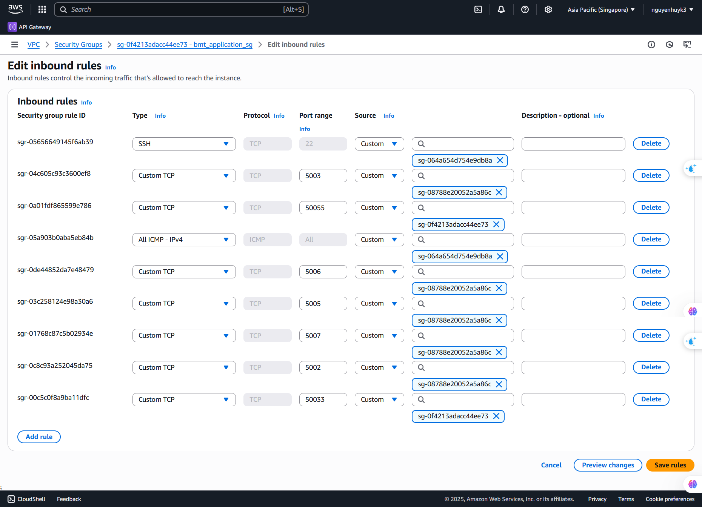
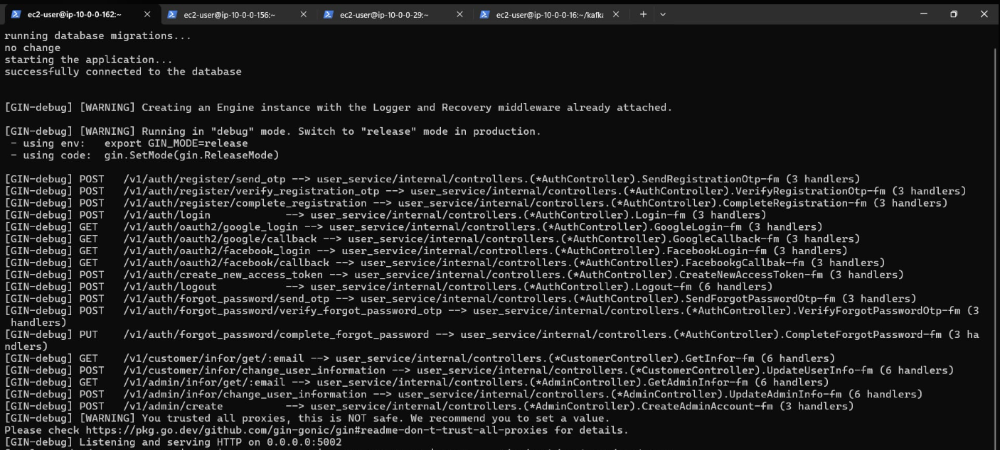
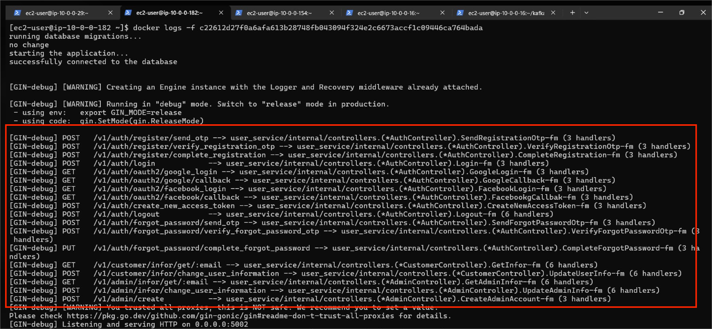

**Nội dung:**

- [Tổng quan](#tổng-quan)
- [Tạo ứng dụng backend bằng EC2](#tạo-ứng-dụng-backend-bằng-ec2)
- [Cài đặt service](#cài-đặt-service)
- [Khởi động User Service](#khởi-động-user-service)
- [Khởi động Mail Service](#khởi-động-mail-service)
- [Khởi động Product Service](#khởi-động-product-service)
- [Khởi động Upload Service](#khởi-động-upload-service)
- [Khởi động Showtime Service](#khởi-động-showtime-service)
- [Khởi động Order Service](#khởi-động-order-service)
- [Khởi động Payment Service](#khởi-động-payment-service)
- [Tổng kết](#-tổng-kết)

### Tổng quan

Trong bước này chúng ta sẽ tạo các tài nguyên và đặt chúng nằm ở **Private Application Subnet**. Và chúng ta sẽ lấy các ứng dụng backend từ **Docker hub**.

---

### Tạo ứng dụng backend bằng EC2

Chúng ta sẽ tạo các ứng dụng backend lần lượt là: **bmt_user**, **bmt_mail**, **bmt_product**, **bmt_showtime**, **bmt_upload**, **bmt_order**, **bmt_payment**.


1. Đi vào **EC2** console.
2. Nhấn vào **Launch instance**.
3. Đặt tên theo service.
4. Chúng ta nên tạo Key pair (đặt tên theo service).
5. Chọn VPC (VPC mà chúng ta đã tạo ở bước trước).
6. Đặt instance này ở public subnet.
7. Tạo mới **Sercurity group** mới (đăt tên là application_sg) và chúng ta nên sửa đổi **Sercurity group** này như trong ảnh. 



Giải thích:
- **PORT 5002**: Đây là port sẽ chạy ở **User service**. Và sẽ cho phép **SG** của **EC2 Kong gateway** có thể truy cập vào.
- **PORT 5003**: Đây là port sẽ chạy ở **Product service**. Và sẽ cho phép **SG** của **EC2 Kong gateway** có thể truy cập vào.
- **PORT 5005**: Đây là port sẽ chạy ở **Showtime service**. Và sẽ cho phép **SG** của **EC2 Kong gateway** có thể truy cập vào.
- **PORT 5006**: Đây là port sẽ chạy ở **Order service**. Và sẽ cho phép **SG** của **EC2 Kong gateway** có thể truy cập vào.
- **PORT 5007**: Đây là port sẽ chạy ở **Payment service**. Và sẽ cho phép **SG** của **EC2 Kong gateway** có thể truy cập vào.
- **PORT 50033**: Đây là port sẽ chạy ở **Product service** và cho **RPC server**. Và sẽ cho phép **SG** của chính **EC2** có thể kết nối tới port này.
- **PORT 50055**: Đây là port sẽ chạy ở **Showtime service** và cho **RPC server**. Và sẽ cho phép **SG** của chính **EC2** có thể kết nối tới port này.


### Cài đặt service

Truy cập vào từng EC2 của **Private application subnet**.


Cài đặt Docker.

```bash
# Cập nhật hệ thống
sudo dnf update -y

# Cài đặt Docker
sudo dnf install docker -y

# Khởi động Docker service
sudo systemctl start docker
sudo systemctl enable docker

# Thêm user vào docker group
sudo usermod -a -G docker ec2-user

# Logout và login lại để áp dụng thay đổi group
exit
```
Sau khi cài đặt Docker thành công thì ta sẽ lấy các image về. Truy cập vào **https://hub.docker.com/repository/docker/nguyenhuyk3/bmt/tags** để có thể lấy các iamges.

Chúng ta sẽ lấy các image bằng câu lệnh **docker pull nguyenhuyk3/bmt:<SERVICE_NAME>**. Với mỗi **EC2 instance** thì sẽ là một service.

---

### Khởi động User Service

1. Chúng ta sẽ tạo file **app.env** bằng câu lệnh **nano /home/ec2-user/app.env** với nội dung bên dưới.

````bash
SERVER_PORT=5002

SERCET_KEY=EoLC-@*&!4mNtV+?dpu0`C+dAwKmKy1X

ISS=a404f1c1-7058-4af7-976a-3aaf6f742fe8

FIXED_IV=aBcD1EfGhIjK2LmN

KEY_FOR_ADMIN=bba7f5cd-b619-4e46-bd7e-17cdad1bda11

RDS_DB_URL=postgres://<YOUR_USERNAME>:<YOURR_PASSWORD>@<YOUR_HOST>:5432/<YOUR_DATABASE_NAME>?sslmode=require
````

Giải thích
- **SERVER_PORT**: Đây là port mà User Service sẽ chạy.
- **SERCET_KEY**: Trong JWT (JSON Web Token), SECRET_KEY là một chuỗi bí mật dùng để ký và xác minh token trong thuật toán ký đối xứng, ví dụ như HS256, HS384, HS512.
- **ISS**: Trường iss là viết tắt của Issuer (người phát hành token). Nó biểu thị ai đã tạo ra token đó – thường là một hệ thống xác thực như Auth Server, Identity Provider, hoặc một service backend. Và chúng ta sẽ lấy được nó khi đăng kí thành công JWT credential trong Kong.
- **FIXED_IV**: Trong AES (Advanced Encryption Standard), thuật ngữ fixed IV (Initialization Vector cố định) đề cập đến việc sử dụng cùng một IV cho nhiều lần mã hóa.
- **KEY_FOR_ADMIN**: Đây là key dùng để đăng kí tài khoản với quyền Admin.
- **RDS_DB_URL**: Đây là một PostgreSQL connection string. Và nội dung của connection string chúng ta sẽ lấy ở **RDS** khi tạo PostgreSQL.

2. Chúng ta sẽ tạo file **prod.yaml** bằng câu lệnh **nano /home/ec2-user/prod.yaml** với nội dung bên dưới.

```yaml
database:
  host: <YOUR_DB_HOST_AT_RDS> 
  port: 5432
  username: "<YOUR_USERNAME"
  password: "<YOUR_PASSWORD>"
  db_name: "bmt_user"
  max_idle_conns: 10
  max_open_conns: 100
  conn_max_lifetime: 3600
redis:
  host: "<YOUR_REDIS_HOST_AT_ELASTICACHE>"
  port: 6379
  password: ""
  database: 0
kafka:
  kafka_broker_1: "<YOUR_KAFKA_BOOTRAP_SERVER_AT_MSK>"
  kafka_broker_2: "<YOUR_KAFKA_BOOTRAP_SERVER_AT_MSK>"
```

3. Sau khi tạo thành công 2 file trên thì chúng ta sẽ chạy câu lệnh

```bash
docker run -d \
  --env-file /home/ec2-user/app.env \
  -v /home/ec2-user/prod.yaml:/app/local.yaml \
  -p 5002:5002 \
  --name user_service \
  nguyenhuyk3/bmt:bmt_user
```
4. Chúng ta sẽ chạy câu lệnh **docker logs -f <CONTAINER_ID>** và sẽ thấy được màn hình như bên dưới.



---

### Khởi động Mail Service

1. Chúng ta sẽ tạo file **prod.yaml** bằng câu lệnh **nano /home/ec2-user/prod.yaml** với nội dung bên dưới.

```yaml
mail:
  host: "" # Host SMTP của Amazon SES tại khu vực ap-southeast-1 (Singapore).
  port: "2587" # Cổng kết nối SMTP.
  username: "" # SMTP Username.
  password: "" # SMTP Password.
kafka:
  kafka_broker_1: "<YOUR_KAFKA_BOOTRAP_SERVER_AT_MSK>"
  kafka_broker_2: "<YOUR_KAFKA_BOOTRAP_SERVER_AT_MSK>"
zap_log:
  log_level: debug
  file_log_name: "./storages/logs/bmt_mail_service.log"
  max_size: 500
  max_backups: 3
  max_age: 28
  compress: true
```

2. Chúng ta sẽ tạo file **app.env** bằng câu lệnh **nano /home/ec2-user/app.env** với nội dung bên dưới.

```bash
FROM_EMAIL= "" # Đây là email dùng để gửi mail.
```

3. Sau khi tạo thành công 2 file trên thì chúng ta sẽ chạy câu lệnh

```bash
docker run -d \
  --env-file /home/ec2-user/app.env \
  -v /home/ec2-user/prod.yaml:/app/local.yaml \
  --name mail_service \
  nguyenhuyk3/bmt:bmt_mail
```
4. Chúng ta sẽ thấy màn hình console chạy cũng tương tự như ở **User service**.

---

### Khởi động Product Service

1. Chúng ta sẽ tạo file **prod.yaml** bằng câu lệnh **nano /home/ec2-user/prod.yaml** với nội dung bên dưới.

```yaml
database:
  host: <YOUR_DB_HOST_AT_RDS> 
  port: 5432
  username:  "<YOUR_USERNAME"
  password: "<YOUR_PASSWORD>"
  db_name: "bmt_product"
  max_idle_conns: 10
  max_open_conns: 100
  conn_max_lifetime: 3600
redis:
  host: "<YOUR_REDIS_HOST_AT_ELASTICACHE>"
  port: 6379
  password: ""
  database: 0
kafka:
  kafka_broker_1: "<YOUR_KAFKA_BOOTRAP_SERVER_AT_MSK>"
  kafka_broker_2: "<YOUR_KAFKA_BOOTRAP_SERVER_AT_MSK>"
s3:
  aws_access_key_id: "" # Chúng ta sẽ vào IAM Console để lấy AWS ACCESS KEY ID.
  aws_sercet_access_key_id: "" # Chúng ta sẽ vào IAM Console để lấy AWS SERCET ACCESS KEY ID.
  aws_region: "ap-southeast-1" 
  film_bucket_name: "bmt-s3-main-bucket" # Chúng ta sẽ vào tạo 1 S3 bucket với tên như mô tả.
  thumbnail_film_bucket_name: "bmt-s3-thumbnail-bucket" # Chúng ta sẽ vào tạo 1 S3 bucket với tên như mô tả.
```

2. Chúng ta sẽ tạo file **app.env** bằng câu lệnh **nano /home/ec2-user/app.env** với nội dung bên dưới.
````bash
SERVER_PORT=5003 # Đây là port của Product service.

RPC_SERVER_PORT=50033 # Đây là port dùng để chạy RPC server.

RDS_DB_URL=postgres://<YOUR_USERNAME>:<YOURR_PASSWORD>@<YOUR_HOST>:5432/<YOUR_DATABASE_NAME>?sslmode=require
````

3. Sau khi tạo thành công 2 file trên thì chúng ta sẽ chạy câu lệnh

```bash
docker run -d \
  --env-file /home/ec2-user/app.env \
  -v /home/ec2-user/prod.yaml:/app/local.yaml \
  -p 5003:5003 -p 50033:50033 \
  --name product_service \
  nguyenhuyk3/bmt:bmt_product
```

4. Chúng ta sẽ thấy màn hình console chạy cũng tương tự như ở **User service**.

----

### Khởi động Upload Service

1. Chúng ta sẽ tạo file **prod.yaml** bằng câu lệnh **nano /home/ec2-user/prod.yaml** với nội dung bên dưới.

````yaml
kafka:
  kafka_broker_1: "<YOUR_KAFKA_BOOTRAP_SERVER_AT_MSK>"
  kafka_broker_2: "<YOUR_KAFKA_BOOTRAP_SERVER_AT_MSK>"
s3:
  aws_access_key_id: "" # Chúng ta sẽ vào IAM Console để lấy AWS ACCESS KEY ID.
  aws_sercet_access_key_id: "" # Chúng ta sẽ vào IAM Console để lấy AWS SERCET ACCESS KEY ID.
  aws_region: "ap-southeast-1"
  film_bucket_name: "bmt-s3-main-bucket" # Chúng ta sẽ vào tạo 1 S3 bucket với tên như mô tả.
sqs:
  queue_url: "" # Chúng ta sẽ tạo 1 SQS Queue và lấy URL của nó.
````

2. Chúng ta sẽ tạo 1 **Policy** để cho phép service của chúng ta có thể sử dụng SQS bên trong **EC2**. Và chúng ta sẽ tạo **Role** với **Policy** vừa tạo. Sau đó chúng ta sẽ thêm **Role** vừa tạo cho **EC2** deloy **Upload Service**. Và chúng ta sẽ tạo **Policy** như bên dưới.

```json
{
	"Version": "2012-10-17",
	"Statement": [
		{
			"Effect": "Allow",
			"Action": [
				"sqs:ReceiveMessage",
				"sqs:DeleteMessage",
				"sqs:GetQueueAttributes"
			],
			"Resource": "ARN_OF_SQS"
		}
	]
}
```

3. Chúng ta sẽ tạo file **app.env** bằng câu lệnh **nano /home/ec2-user/app.env** với nội dung bên dưới.

````bash
AWS_REGION=ap-southeast-1
````

4. Sau khi tạo thành công 2 file trên thì chúng ta sẽ chạy câu lệnh

```bash
docker run -d \
  --env-file /home/ec2-user/app.env \
  -v /home/ec2-user/prod.yaml:/app/local.yaml \
  --name upload_service \
  nguyenhuyk3/bmt:upload_service
```

5. Chúng ta sẽ thấy màn hình console chạy cũng tương tự như ở **User service**.

---

### Khởi động Showtime Service

1. Chúng ta sẽ tạo file **prod.yaml** bằng câu lệnh **nano /home/ec2-user/prod.yaml** với nội dung bên dưới.

```yaml
database:
  host: <YOUR_DB_HOST_AT_RDS> 
  port: 5432
  username:  "<YOUR_USERNAME"
  password: "<YOUR_PASSWORD>"
  db_name: "bmt_showtime"
  max_idle_conns: 10
  max_open_conns: 100
  conn_max_lifetime: 3600
redis:
  host: "<YOUR_REDIS_HOST_AT_ELASTICACHE>"
  port: 6379
  password: ""
  database: 0
kafka:
  kafka_broker_1: "<YOUR_KAFKA_BOOTRAP_SERVER_AT_MSK>"
  kafka_broker_2: "<YOUR_KAFKA_BOOTRAP_SERVER_AT_MSK>"
```

2. Chúng ta sẽ tạo file **app.env** bằng câu lệnh **nano /home/ec2-user/app.env** với nội dung bên dưới.

````bash
SERVER_PORT=5005 # Đây là port mà service sẽ chạy.
PRODUCT_RPC_SERVER_PORT=50033 # Vì Order Service cần lấy 1 số tài nguyên từ Product Service qua gRPC.
SHOWTIME_RPC_SERVER_PORT=50055 # Vì Order Service cần lấy 1 số tài nguyên từ Showtime Service qua gRPC.

RDS_DB_URL=postgres://<YOUR_USERNAME>:<YOURR_PASSWORD>@<YOUR_HOST>:5432/<YOUR_DATABASE_NAME>?sslmode=require
````

3. Sau khi tạo thành công 2 file trên thì chúng ta sẽ chạy câu lệnh.

```bash
docker run -d \
  --env-file /home/ec2-user/app.env \
  -v /home/ec2-user/prod.yaml:/app/local.yaml \
  -p 5005:5005 \
  --name showtime_service \
  nguyenhuyk3/bmt:bmt_showtime
```

4. Chúng ta sẽ thấy màn hình console chạy cũng tương tự như ở **User service**.

----

### Khởi động Order Service

1. Chúng ta sẽ tạo file **prod.yaml** bằng câu lệnh **nano /home/ec2-user/prod.yaml** với nội dung bên dưới.

````yaml
database:
  host: <YOUR_DB_HOST_AT_RDS> 
  port: 5432
  username:  "<YOUR_USERNAME"
  password: "<YOUR_PASSWORD>"
  db_name: "bmt_order"
  max_idle_conns: 10
  max_open_conns: 100
  conn_max_lifetime: 3600
redis:
  host: "<YOUR_REDIS_HOST_AT_ELASTICACHE>"
  port: 6379
  password: ""
  database: 0
kafka:
  kafka_broker_1: "<YOUR_KAFKA_BOOTRAP_SERVER_AT_MSK>"
  kafka_broker_2: "<YOUR_KAFKA_BOOTRAP_SERVER_AT_MSK>"
````
2. Chúng ta sẽ tạo file **app.env** bằng câu lệnh **nano /home/ec2-user/app.env** với nội dung bên dưới.

````bash
SERVER_PORT=5006 # Đây là port mà service sẽ chạy.
PRODUCT_RPC_SERVER_PORT=50033 # Vì Order Service cần lấy 1 số tài nguyên từ Product Service qua gRPC.
SHOWTIME_RPC_SERVER_PORT=50055 # Vì Order Service cần lấy 1 số tài nguyên từ Showtime Service qua gRPC.

RDS_DB_URL=postgres://<YOUR_USERNAME>:<YOURR_PASSWORD>@<YOUR_HOST>:5432/<YOUR_DATABASE_NAME>?sslmode=require
````

3. Sau khi tạo thành công 2 file trên thì chúng ta sẽ chạy câu lệnh.

```bash
docker run -d \
  --env-file /home/ec2-user/app.env \
  -v /home/ec2-user/prod.yaml:/app/local.yaml \
  -p 5006:5006 \
  --name order_service \
  nguyenhuyk3/bmt:bmt_order
```

4. Chúng ta sẽ thấy màn hình console chạy cũng tương tự như ở **User service**.

----

### Khởi động Payment Service

1. Chúng ta sẽ tạo file **prod.yaml** bằng câu lệnh **nano /home/ec2-user/prod.yaml** với nội dung bên dưới.

```yml
database:
  host: <YOUR_DB_HOST_AT_RDS> 
  port: 5432
  username:  "<YOUR_USERNAME"
  password: "<YOUR_PASSWORD>"
  db_name: "bmt_order"
  max_idle_conns: 10
  max_open_conns: 100
  conn_max_lifetime: 3600
redis:
  host: "<YOUR_REDIS_HOST_AT_ELASTICACHE>"
  port: 6379
  password: ""
  database: 0
kafka:
  kafka_broker_1: "<YOUR_KAFKA_BOOTRAP_SERVER_AT_MSK>"
  kafka_broker_2: "<YOUR_KAFKA_BOOTRAP_SERVER_AT_MSK>"
momo:
  end_point: "https://test-payment.momo.vn/v2/gateway/api/create"
  partner_code: "MOMO"
  access_key: "F8BBA842ECF85"
  secret_key: "K951B6PE1waDMi640xX08PD3vg6EkVlz"
  redirect_url: "http://<PUBLIC_IP_OF_KONG_GATEWAY>:8000/v1/momo/customer/verify_payment" # Đây là api sẽ được gọi sau khi người dùng thanh toán MOMO. Và nó sẽ xử lí theo trường hợp thanh toán thành công hay thất bại.
  mobile_redirect_url: "bmt://payment-result"
  ipn_url: "http://<PUBLIC_IP_OF_KONG_GATEWAY>/v1/momo/customer/verify_payment"
```

2. Chúng ta sẽ tạo file **app.env** bằng câu lệnh **nano /home/ec2-user/app.env** với nội dung bên dưới.

```bash
SERVER_PORT=5007 # Đây là port mà service sẽ chạy

RDS_DB_URL=postgres://<YOUR_USERNAME>:<YOURR_PASSWORD>@<YOUR_HOST>:5432/<YOUR_DATABASE_NAME>?sslmode=require
```

3. Sau khi tạo thành công 2 file trên thì chúng ta sẽ chạy câu lệnh.

```bash
docker run -d \
  --env-file /home/ec2-user/app.env \
  -v /home/ec2-user/prod.yaml:/app/local.yaml \
  -p 5007:5007 \
  --name order_payment \
  nguyenhuyk3/bmt:bmt_payment
```

4. Chúng ta sẽ thấy màn hình console chạy cũng tương tự như ở **User service**.

---

#### Tổng kết

- Chúng ta đã hoàn thành việc khởi tạo các Services nằm trong **Private Application Subnet**.
- Bạn có thể thấy 1 số apis khi các service được chạy.



- Trong ảnh trên bạn có thể thấy những services có apis riêng của nó nhưng bạn không thể gọi được vì hiện tại nó đang nằm trong 1 private subnet. Và chúng ta muốn giao tiếp với nó chúng ta sẽ thực hiện thông qua **Kong gateway**.


