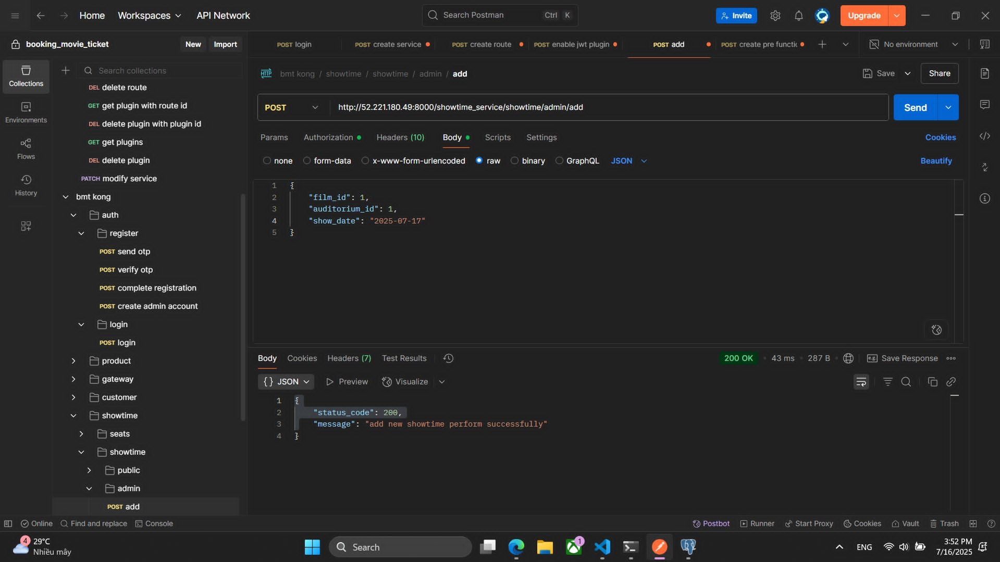

**Nội dung:**

- [Tổng quan](#tổng-quan)
- [Thực hiện đăng kí tài khoản người dùng](#thực-hiện-đăng-kí-tài-khoản-người-dùng)
- [Thực hiện thêm phim](#thực-hiện-thêm-phim)
- [Thực hiện đặt vé xem phim](#thực-hiện-đặt-vé-xem-phim)
- [Tổng kết](#tổng-kết)

---

### Tổng quan

Sau khi thực hiện xong các bước trên thì trong phần này chúng sẽ thực hiện gọi các APIs với tư cách là 1 máy khách.

---

### Thực hiện đăng kí tài khoản người dùng

Thực hiện đăng kí người dùng với email

Chúng ta có thể thấy rằng sau khi người đăng kí với email **huykimcuong5@gmail.com** thì ở **Mail service** nhận được message từ **Kafka** và thực hiện việc gửi mail với mã OTP. 

Hoàn thành các bước tiếp theo

Có thể thấy chúng ta đã thực hiện 3 APIs để hoàn thành việc đăng kí.

---

### Thực hiện thêm phim

Đăng nhập tài khoản với quyền admin.

Thêm phim với quyền admin.

Khi thực hiện thêm phim thì ảnh và trailer của phim sẽ được tải lên S3 và S3 sẽ đưa sự kiện Put Object vào SNS và SQS sẽ nhận message từ SNS. Và upload service sẽ nhận message từ SQS.

Và upload service sẽ ghi message vào **Kafka** với những thông tin cần thiết để cho product service cập nhập URL của ảnh và trailer vào database.

Và ta truy cập vào database để xem những thông tin về ảnh và trailer của phim.

Cũng tương tự như với FAB (Food And Beverage)

Ở product service thì sẽ nhận message từ upload service khi chúng ta tải ảnh lên S3 thành công.

### Thực hiện đặt vé xem phim

Trước tiên chúng ta sẽ phải thêm showtime mới. Và chúng ta sẽ thực hiện 1 API gọi là Realease showtime. Sau đó chúng ta và database kiểm tra ghế cho showtime đó.

Kiểm tra ghế có showtime id = 3.

Chúng ta sẽ thực hiện API để đặt ghế với showtime id = 3. Sau khi đặt ghế thành công thì sẽ được trả order id về.

Sau khi gọi API tạo payment URL với order id vừa được tạo khi thực hiện API tạo order.

Sau khi thanh toán thành công thì payment service trả về thông tin của vé xem phim.

Và chúng ta sẽ cùng kiểm tra các topic mà chúng ta đã tạo thủ công với tên lần lượt là: **bmt_payment.public.outboxes**, **bmt_order.public.outboxes**.

Như có thể thấy trong ảnh thì trong cả 2 topic thì đều có những message, chính những message này đã được những service khác tiêu thụ và xử lí theo nội dung của message.

---

## Tổng kết

Trong phần này, chúng ta đã đóng vai trò là một máy khách để thực hiện toàn bộ luồng sử dụng của hệ thống backend, từ việc đăng ký tài khoản người dùng đến đặt vé xem phim và xử lý thanh toán. Qua từng bước, chúng ta đã thấy rõ:

- Luồng đăng ký tài khoản được thực hiện thông qua chuỗi các API liên quan đến xác thực và xác minh OTP. Sau khi người dùng đăng ký, Mail Service đã nhận message từ Kafka và gửi OTP đến email thông qua Amazon SES.
- Luồng thêm phim với quyền admin bao gồm việc tải ảnh và trailer lên Amazon S3, nơi sự kiện PutObject kích hoạt SNS → SQS → Upload Service. Sau đó, Upload Service gửi message vào Kafka để Product Service cập nhật URL hình ảnh và video vào cơ sở dữ liệu.
- Luồng đặt vé xem phim bắt đầu từ việc tạo showtime, kiểm tra ghế theo showtime_id, thực hiện đặt vé, tạo đơn hàng và nhận URL thanh toán. Sau khi thanh toán thành công, hệ thống đã tạo vé xem phim và lưu thông tin liên quan.
- Cơ chế giao tiếp giữa các service sử dụng Kafka và SQS giúp hệ thống hoạt động theo mô hình event-driven, đảm bảo sự tách biệt giữa các thành phần và khả năng mở rộng linh hoạt.
- Cuối cùng, chúng ta cũng đã xác nhận rằng các message được ghi vào các Kafka topic như bmt_payment.public.outboxes và bmt_order.public.outboxes đã được các service tiêu thụ thành công để xử lý các nghiệp vụ liên quan.

Phần thực hành này giúp ta hiểu rõ hơn về cách hệ thống backend vận hành trong môi trường phân tán, sử dụng các dịch vụ như Kafka, S3, SQS và API Gateway một cách hiệu quả và đồng bộ.