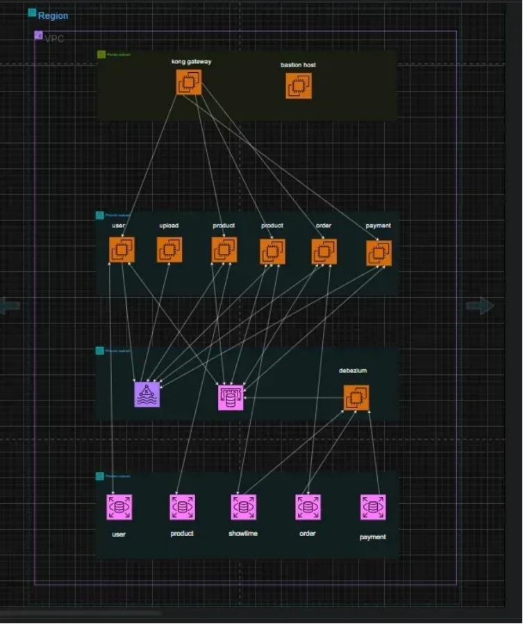

# Xây dựng Kiến trúc Hướng Sự kiện với AWS

## Tổng quan

Trong bài thực hành này, bạn sẽ xây dựng một kiến trúc hướng sự kiện phức tạp trên AWS bằng cách sử dụng các dịch vụ: **EC2**, **Amazon MSK (Kafka)**, **RDS**, và **ElastiCache**. Ngoài ra, bạn sẽ học cách triển khai chiến lược giám sát hệ thống và tối ưu hóa chi phí vận hành.

Phòng lab hướng dẫn từng bước để thiết kế, triển khai và tối ưu hóa một quy trình xử lý không đồng bộ theo kiến trúc hướng sự kiện với khả năng mở rộng, chống lỗi, và dễ quan sát.

## Mục tiêu chính

- Thiết kế kiến trúc với **Producer** và **Consumer** tách biệt rõ ràng.
- Đảm bảo **eventual consistency** bằng mô hình Event-Driven.
- Đồng bộ dữ liệu giữa các service thông qua **Debezium**.
- Cải thiện hiệu suất hệ thống bằng cách áp dụng **caching** với ElastiCache.
- Và chúng ta sẽ thực hiện theo kiến trúc như ảnh bên dưới:

{}
**Yêu cầu trước:** Bạn cần có kiến thức cơ bản về EC2, IAM, Kafka, Redis, cũng như hiểu biết về định dạng JSON, cơ chế retry, và các mô hình xử lý bất đồng bộ (async patterns).
{}

---

## Các dịch vụ chính

### EC2 (Elastic Compute Cloud)
Dịch vụ máy chủ ảo linh hoạt cho phép triển khai ứng dụng trên hạ tầng cloud có thể mở rộng và quản lý được.

### Amazon MSK (Managed Streaming for Apache Kafka)
Dịch vụ Kafka được quản lý hoàn toàn bởi AWS, giúp dễ dàng triển khai hệ thống pub-sub và event streaming.

### Amazon RDS (Relational Database Service)
Dịch vụ cơ sở dữ liệu quan hệ được quản lý, hỗ trợ nhiều engine như PostgreSQL, MySQL, giúp dễ dàng vận hành, sao lưu và mở rộng.

### Amazon ElastiCache
Dịch vụ caching trong bộ nhớ giúp giảm độ trễ truy vấn và tăng tốc độ phản hồi của hệ thống thông qua Redis hoặc Memcached.

### Amazon CloudWatch
Nền tảng giám sát tập trung của AWS. Được sử dụng để:
- Ghi nhật ký hoạt động và lỗi
- Theo dõi độ trễ, tần suất lỗi, hiệu năng dịch vụ (RDS, MSK, EC2, ElastiCache)
- Thiết lập cảnh báo và dashboards
- Truy vấn log qua **CloudWatch Logs Insights**

### Monitoring & Cost Optimization
- Sử dụng CloudWatch **Metrics**, **Logs** và **Alarms** để theo dõi toàn bộ hệ thống.
- Phân tích chi phí bằng **AWS Cost Explorer**.
- Tối ưu hóa vận hành thông qua truy vấn log và phân tích hành vi hệ thống.

---

## Nội dung thực hành

1. [Tạo tài nguyên mạng AWS](1-creating-networking-resource-aws/)
2. [Triển khai ứng dụng đầu tiên ở Public Subnet](2-creating-first-applications-at-ps/)
3. [Tạo cơ sở dữ liệu trong Private Database Subnet](3-creating-database-at-pds/)
4. [Khởi tạo tài nguyên Kafka/Redis ở Private Middleware Subnet](4-creating-resources-at-pms/)
5. [Triển khai backend service tại Private Application Subnet](5-creating-resources-at-pas/)
6. [Routing API bằng Kong Gateway](6-routing-api-with-kong-gateway/)
7. [Thực hiện các API của các dịch vụ backend](7-perform-apis-of-backend-applications/)
8. [Thiết lập giám sát và logging với CloudWatch](8-setting-up-monitoring-and-logging-with-CloudWatch/)
9. [Tối ưu hóa chi phí và hiệu suất](9-optimizing-for-cost-and-performance/)
